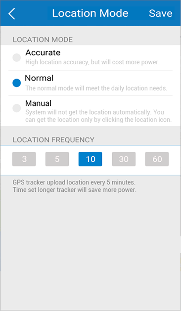

## Main Screen

The main screen provides buttons to help you monitor the MOVETRACK.

## Safe Zone

Touchto enter the page.
you can now define geographical areas called safe zones. When your MOVETRACK leaves one of these zones, you will be notified in the App.

## Power Save

Access this page by either touchingor from “Settings-> Power Save”. You can adjust the location frequency (every 3, 5, 10, 30 or 60 minutes) and mode (Accurate, Normal or Manual), to achieve your ideal compromise between accuracy and battery life.

## History Location

Access this page from “Settings-> History Location”. To view the MOVETRACK's location on a particular day/timeline, touchto specify the date and time range (Start Time and End Time). The map will automatically zoom to show all the recorded locations of your MOVETRACK. Zoom in or out to get a clearer view.

FAQ

1. How come I cannot obtain the position of my MOVETRACK?  

	Confirm that the GPRS service is enables on your SIM card.  
	Check if a Nano-SIM card is inserted correctly in the MOVETRACK's SIM slot.  
	Check your MOVETRACK's battery level.  
	Ensure that your MOVETRACK has access to a clear signal.  
	Switch your MOVETRACK off and on to restore service.  

2. Why does it take so long to find my location?  

Check which power-saving mode is selected. In manual mode, your MOVETRACK can only find your location when you press the button.  
Note: If you enable the Auto change to Manual mode, your MOVETRACK will auto-switch to manual mode once the power level is less than 20%.

3. How many users can monitor my MOVETRACK at the same time?  

	10 users can monitor your MOVETRACK at any one time. You can invite users by sharing the QR code on the Invite User page.

4. Can I make calls to my MOVETRACK?
 
	Your MOVETRACK does not support voice calling.

5. What do you use my personal data for?  

	Your personal data will not be used for advertising purposes, unless you have given us your express consent. Moreover, we will not transfer your personal data to any third parties without your express consent. The transfer of personal data to public institutions and public authorities that are entitled to receive such information, will only be carried out to the extent required by law or if we are obliged to do so by virtue of a court order or court ruling. If we commission third parties to provide certain services for us, such third parties will only have limited access to personal data, insofar as this is necessary to provide such services. Such third parties are bound to comply with the applicable data protection laws and our Privacy Policy while processing personal data.